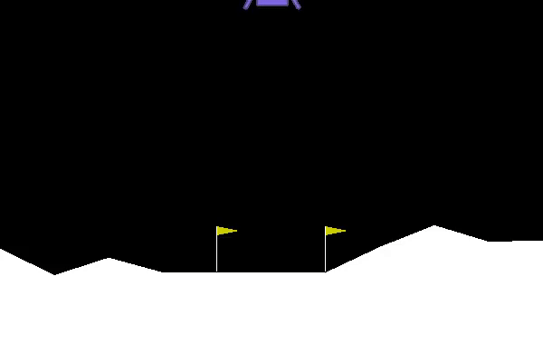

# Monte Carlo Policy Gradient LunarLander AI

Author: Lei Mao

Date: 4/28/2017

## Introduction

[LunarLander-v2](https://gym.openai.com/envs/LunarLander-v2) is one of the learning environments in OpenAI Gym. Here I used Deep Q-Learning to learn how to play LunarLander.

Before Training:

After Training:

## Installation Dependence

* Python 2.7
* Tensorflow 1.0
* Keras 2.0.3
* OpenAI Gym Beta

## AI Features

The LunarLander AI was developed using REINFORCE Monte Carlo Policy Gradient. 

The AI program was written in Python using Keras, which makes the code for neural network neat and easy to understand.

The AI was wrapped as class, which makes it universal for all different kind of environment APIs in OpenAI Gym.

## Run AI in CartPole

The AI needs to be trained before the game. To train the AI, run the command "python OpenAI.py -m train". The AI has already been trained and stored as AI_model.h5 file if you do not want to do the training.

To allow the trained AI to play the game, run the command "python OpenAI.py -m test".

## Optimazation Notes

<https://leimao.github.io/journal/REINFORCE-Policy-Gradient.html>

